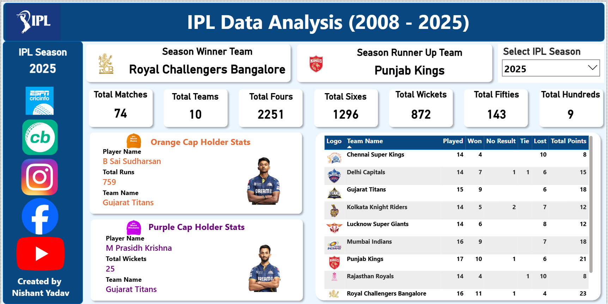

# IPL-Data-Analysis-Dashboard-Power-BI-Project-
This project presents an interactive Power BI dashboard analyzing IPL (Indian Premier League) data. It provides insights into team performance, player statistics, match outcomes, and overall tournament trends.

Project Overview:

The objective of this project is to analyze IPL data and transform it into an interactive dashboard for better decision-making and insights.

This project demonstrates:

* Data cleaning and transformation
* Data modeling
* DAX calculations
* Interactive dashboard design

Dataset Information:

The project uses multiple datasets:

* **ipl_matches_data.csv** → Match-level information
* **ball_by_ball_data.csv** → Ball-by-ball details
* **players-data-updated.csv** → Player statistics
* **teams_data.csv** → Team information

Features:

* Interactive filters (Team, Season, Player)
* KPI cards (Total Matches, Runs, Wickets, etc.)
* Team performance comparison
* Player performance analysis
* Match result insights
* Dynamic visualizations

Dashboard Highlights:

* Total matches played and results
* Top run scorers and wicket takers
* Team-wise performance analysis
* Season-wise trends
* Toss impact on match results
* Venue-based performance

Tools & Technologies:

* Power BI
* DAX (Data Analysis Expressions)
* Data Modeling
* CSV datasets

How to Use:

1. Download the `.pbix` file
2. Open in Power BI Desktop
3. Interact with filters and slicers
4. Explore different pages of the dashboard

Project Screenshots:

Dashboard Overview

Key Insights:

* Certain teams consistently outperform others across seasons
* Top players significantly impact match outcomes
* Toss decisions influence match results in specific conditions
* Venue plays a crucial role in team performance

Future Improvements:

* Add predictive analysis (win probability)
* Integrate real-time data updates
* Enhance visuals with advanced storytelling
* Deploy dashboard to Power BI Service

Author:

Nishant Yadav

License:

This project is for learning and portfolio purposes.
